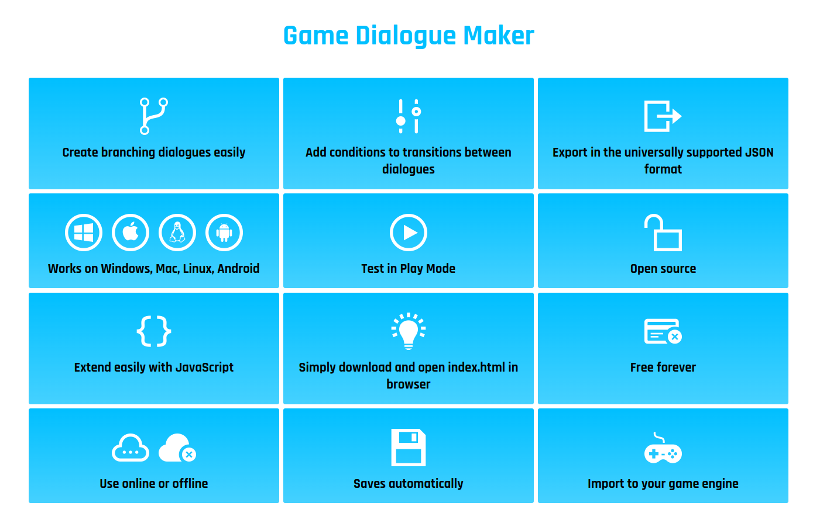

# GameDialoqueMaker

 Html based simple system for creating branching video game dialogue and export to json.

 Simply download the files and open index.html in your browser.

 Or if you want to just try it out online, go here: 
 https://ecation.fi/gameDialogueMaker/

## Exports

Click **Export file**, choose JSON, plain text, **Construct 3**, **Godot 4**, **Unity**, **Unreal Engine**, **GameMaker**, or **GDevelop**, then download.
Settings selects the default format. JSON and engine exports leave the live
editor intact, so you can continue editing after exporting.

Downloadable samples use the distinct English names **Mira** (red) and **Rowan** (green), both with playable conversations. The Construct player's blue square has a following **Player** label.

All six downloadable engine samples include an apple quest. Talk to Mira, close the conversation, walk into the little red apple with green leaves, then return to Mira. The apple disappears and sets numeric `hasApple` from `0` to `1`. Mira's two root connections use the normal dialogue conditions `hasApple = 0` (request) and `hasApple = 1` (thank you). Returning before pickup repeats the request. Restarting the game resets the quest. The source sample is `tests/dialogue-sample.js`; its `demoAppleQuest` flag enables the pickup only in demo exports.
Duplicate names and Unicode edge cases are confined to automated test fixtures.

The Construct export creates `dialogue-playground.c3p` locally, including:

- A blue player and one colored, labeled NPC sprite per character tree.
- Arrow-key / WASD movement, a scrolling scene, and conversations on contact.
- Multiline dialogue pages, questions and answers, next-node jumps, and simulated
  fight outcomes. Close with Escape, then move away and return to restart.
- A **Test variables** panel for conditions. Numbers start at 0 and strings at
  an empty string. All conditions on a connection must pass. Normal nodes take
  the first available outgoing connection; explicit Next is used only without
  outgoing connections. Root connections determine the starting dialogue.

Open the C3P as a local project in Construct 3, then Preview. The runner uses a
JavaScript script file and HTML dialogue controls, with worker mode disabled.
Use a Construct plan with sufficient scripting capacity; this runtime exceeds
the Free Edition's script allowance. No third-party addons are needed.

The generated project has `NPC_1`, `NPC_2`, etc. mapped to character array order,
so duplicate names and Unicode names work. Edit `Files/dialogue.json` to change
dialogue and `Scripts/main.js` to customize gameplay. Game scripts can update
`globalThis.gdmDialogueVariables` to control conditions. Battle choices are
testing controls, not a combat system. Export again to add or remove characters.
Empty character trees still get sprites. Missing connections and invalid IDs
produce an export error instead of a broken project.

## Godot export

Choose **Godot 4**, extract `dialogue-godot.zip`, and import `project.godot`
in Godot 4.5 or newer. Press **F5** to run. Move with arrows or WASD and touch
an NPC to start dialogue. Use the buttons (mouse or Tab/Enter) to choose answers,
and Escape to close. Leave the NPC and return to restart its conversation.

The project includes native Godot scenes and GDScript:

- `scenes/main.tscn`: all characters placed in an expandable test world.
- `scenes/player.tscn`: a CharacterBody2D player, collision shape, and Camera2D.
- `scenes/npc.tscn`: reusable Area2D contact triggers with colored shapes and names.
- `scenes/dialogue_ui.tscn`: native, scrollable dialogue and test-variable controls.
- `scripts/dialogue_session.gd`: branching traversal, conditions, and Next jumps.
- `dialogue.json`: the exported dialogue, including original names and text.

Movement pauses while a conversation or the variable panel is open. NPC areas
trigger conversations without acting as solid obstacles. Conditions, multiline
pages, and simulated fight outcomes work as described above. Duplicate names
are supported through each NPC's `character_index`. No addons, web view, .NET,
or external artwork are required. The generated README explains customization.

Edit Godot sources under `export-templates/godot/`, then run
`node tools/build-godot-template.js` to update `js/godotTemplate.js`.
The bundled template keeps browser exports offline-compatible. Shared JSON
cleanup, validation, and ZIP packaging live in `js/exportCommon.js`.

Run `node --test tests/construct-export.test.js tests/godot-export.test.js`.
Set `GODOT_BIN` to a Godot console executable to include real engine tests;
otherwise that test is explicitly skipped. The engine test imports the exported
project and checks physical movement/contact, native UI, page progression,
branches, conditions, Next loops, empty characters, and conversation re-entry.
Run `node tests/godot-export.test.js --sample` to create a sample project under
`artifacts/godot-playground/` and `artifacts/dialogue-godot.zip`.

Verified with Godot 4.7.2: headless import/runtime tests, a rendered screenshot,
and import/run of a ZIP downloaded through the browser's export modal.
Reference: [Godot physics introduction](https://docs.godotengine.org/en/stable/tutorials/physics/physics_introduction.html).

## Unity export

Choose **Unity** to download `dialogue-unity.zip`. This contains an asset kit
for Unity 2022.3 LTS or Unity 6. To try it:

1. Create or open a Unity 2D project (built-in 2D renderer recommended).
2. Extract the ZIP and copy `Assets/GameDialogueMaker` into the project's
   `Assets` folder. Wait for Unity to import and compile.
3. Choose **Tools > Game Dialogue Maker > Create or Open Playground**.
4. Press **Play**. Move with arrows or WASD and touch an NPC to start dialogue.
   Click choices and use Escape to close.

The menu uses Unity's own APIs to import the sprite and save an editable scene
containing a camera, Rigidbody2D player, and one named, colored trigger NPC per
character. Movement pauses during dialogue. Branches, multiline pages, Next
jumps, conditions, test variables, and simulated fight outcomes are included.
Both legacy input and the new Input System are supported. No additional UI
packages are needed; the prototype interface uses Unity IMGUI.

The kit includes typed runtime JSON for JsonUtility, the original editor JSON,
and readable C# scripts. Opening an existing playground preserves scene edits;
the separate **Rebuild Playground** command confirms before replacing it. Use
rebuild after adding or removing characters. Unity creates its own metadata.
The ZIP's README covers integration and limitations.

Edit `export-templates/unity/`, then run `node tools/build-unity-template.js`.
Run `node --test tests/unity-export.test.js` for data preservation, validation,
template consistency, and C# traversal tests. The C# test uses `CSC_BIN` or the
Windows .NET Framework compiler, and explicitly skips if neither is available.
It tests the actual exported data and session code without Unity; it does not
test Unity's serializer, physics, or UI. Run
`node tests/unity-export.test.js --sample` for `artifacts/dialogue-unity.zip`.

Verified: browser export/download, ZIP integrity, and compiled C# traversal
tests. Unity Editor was unavailable, so import, scene creation, and Play mode
still need verification in Unity. The sample includes two characters and a
branching conversation: test both fight outcomes, Next loops, and set `keys`
to 1 to unlock the gate.

## Unreal Engine export

Choose **Unreal Engine 5** to download `dialogue-unreal.zip`, a standalone C++
source project targeting UE 5.3 or newer. Extract it, open
`DialoguePlayground.uproject` with your installed UE5 version, build the module,
and press **Play**. Unreal's C++ toolchain is required (Visual Studio with C++
game development tools and Windows SDK on Windows). The ZIP includes a README
with build instructions and troubleshooting.

The game mode creates a top-down playground when Play starts: a movable sphere,
one labeled NPC cube per character, a floor, lighting, and a following camera.
Use WASD/arrows and touch an NPC to talk. Native overlap triggers start the
conversation. Slate provides scrollable dialogue, choices, and test-variable
controls. Movement pauses while panels are open. Close using the buttons;
Escape normally exits Play-in-Editor. Leave and re-enter an NPC to restart.

Multiline pages, typed conditions, disabled choices, Next jumps, empty characters,
and simulated fight outcomes are supported. Dialogue is compiled into a UTF-8
data header; original editable JSON is included under `DialogueSource/`. After
editing the source JSON, re-export and rebuild. Character text is safely encoded
inside string literals, and never used as C++ identifiers or file paths.

The starting map is Unreal's installed Entry map. No binary maps or Blueprints
are included; the editor viewport is initially empty and the playground appears
at runtime. This is a desktop single-player prototype, intended for Editor
playtesting. Packaged builds, gamepad controls, and networking are not verified.

Edit `export-templates/unreal/`, then run `node tools/build-unreal-template.js`.
Run `node --test tests/unreal-export.test.js`. Tests cover project structure,
validation, preservation, and compiling/running the actual generated C++ data
and session logic. They use `CXX` (GCC/Clang), or `VCVARS64` (Visual Studio's
`vcvars64.bat`); the default Windows path targets Visual Studio 2022 Community.
The compiler test explicitly skips when no configured compiler is available.
Run `node tests/unreal-export.test.js --sample` to create
`artifacts/dialogue-unreal.zip` and the extracted sample project.

Validated with MSVC: dialogue branches, conditions, fight outcomes, Next loops,
Unicode, code-like text, and numeric extremes. Unreal Editor is unavailable here,
so Unreal Header Tool, engine compilation, overlap behavior, and Slate UI still
need an actual Editor test. Follow the exported README's smoke-test checklist.

References: [Unreal game modes](https://dev.epicgames.com/documentation/en-us/unreal-engine/game-mode-and-game-state-in-unreal-engine),
[Visual Studio setup](https://dev.epicgames.com/documentation/en-us/unreal-engine/setting-up-visual-studio-for-unreal-engine).

## GameMaker export

Choose **GameMaker** to download `dialogue-gamemaker.zip`. Extract it, open
`DialoguePlayground.yyp` in GameMaker 2026.x, select a desktop VM target, and
press **F5**. No extensions or C++ tools are required.

The project includes native GML objects and a test room. Its controller loads
Included Files and spawns a blue player plus a colored, labeled NPC for each
character. Move with WASD/arrows; sprite-mask contact starts a conversation.
NPCs act as triggers, and the camera follows through larger casts.

Click dialogue choices, scroll long dialogue with the mouse wheel, and close
with Escape or the close button. Movement pauses while dialogue or test
variables are open. Branches, newline pages, conditions, Next jumps, empty
characters, and simulated fight outcomes are supported. Test variables can be
edited in the preview; click a value, type/backspace, then Apply value.

Original editor data is preserved in `datafiles/dialogue-source.json` alongside
normalized runtime JSON and a simple PNG. User text remains data rather than
generated GML code. Replace the sprite and font to customize the result; the
default GameMaker font may need additional glyph ranges for non-Latin text.
The exporter currently targets desktop, not HTML5/GX.games or mobile.

Edit `export-templates/gamemaker/`, then run
`node tools/build-gamemaker-template.js`. Run
`node --test tests/gamemaker-export.test.js` to check data preservation,
validation, all resource/event/Included File links, template consistency, and
dialogue traversal. The engine-independent GML session is executed unchanged
in a Node harness using its shared JS/GML syntax and GML helper shims. This
tests logic, not GML compiler compatibility or GameMaker rendering/physics.
Run `node tests/gamemaker-export.test.js --sample` to create
`artifacts/dialogue-gamemaker.zip` and an extracted sample project.

GameMaker is unavailable in the development environment, so actual IDE import,
compilation, collision, and GUI testing remain unverified. The exported README
contains setup details and an engine smoke-test checklist.

References: [GameMaker project format](https://manual.gamemaker.io/monthly/en/Additional_Information/Project_Format.htm),
[official example project structure](https://github.com/YoYoGames/GMEXT-Photon/tree/main/source/Photon_gml).

## GDevelop export

Choose **GDevelop** to download `dialogue-gdevelop.zip`. Extract the ZIP, keep
`assets/` beside `game.json`, open `game.json` in the current GDevelop 5 desktop
editor, and click **Preview**. Move with WASD/arrows and touch an NPC to talk.

The scene contains editable native Sprite objects for the player and every NPC,
plus Text labels. Native GDevelop collision masks detect contact. The camera
follows larger casts. An included JavaScript event drives the dialogue and a
scrollable HTML overlay with choices, test variables, and keyboard-accessible
buttons. Movement pauses during dialogue or variable editing. Newline pages,
conditions, Next jumps, empty characters, and simulated fight outcomes are
supported. Close with Escape, move away, and return to restart a conversation.

The `GDMDialogue` scene variable holds the runtime JSON. `dialogue-source.json`
preserves editable source data; editing that file alone does not update the game.
Re-export or edit the scene variable. Names/text remain data and are rendered
with `textContent`, so punctuation, duplicate names, and HTML-like text are safe.
The overlay is removed on scene unload and hidden/restored on pause/resume.
The starter targets desktop keyboard/mouse preview and standard web exports.

`js/gdevelopRuntime.js` contains the exported runtime; traversal reuses the
engine-independent session in `js/constructRuntime.js`. Editable defaults and
the exported README live under `export-templates/gdevelop/`; run
`node tools/build-gdevelop-template.js` after changes. The base project was
generated with official GDevelop core 5.6.283. To regenerate it, run
`node tools/build-gdevelop-base.js /path/to/libGD.js` with its matching WASM file.

Run `node --test tests/gdevelop-export.test.js`. Set `LIBGD_JS` to an official
GDevelop `libGD.js` to include the native project deserialization/round-trip
test; otherwise it explicitly skips. Run
`node tests/gdevelop-export.test.js --sample` to produce
`artifacts/dialogue-gdevelop.zip` and an extracted sample. With the repo served
locally, `tests/gdevelop-runtime-harness.html` exercises the actual exported
runtime against simulated GDevelop APIs.

Verified: official-core project deserialization/round-trip, event JavaScript
syntax, resource references, and browser-harness contact, dialogue pages,
conditional choices, empty characters, pause/resume, and unload cleanup.
The harness does not use the real renderer or collision engine; a graphical
GDevelop Preview run remains unverified. The exported README provides the
engine smoke-test checklist.

References: [GDevelop runtime objects](https://docs.gdevelop.io/GDJS%20Runtime%20Documentation/classes/gdjs.RuntimeObject.html),
[official JavaScript-event example](https://github.com/GDevelopApp/GDevelop-examples/tree/main/examples/javascript-blocks-in-platformer).

## Construct exporter development

`js/constructTemplate.js` contains structural defaults extracted from the supplied
Construct r327 example, without its artwork, fonts, hard-coded gameplay, or demo
dialogues. `tools/build-construct-template.py reference.c3p` regenerates these
defaults. The generated JS is checked in; the original network file is not
required to run or export from the app. The ZIP writer is dependency-free and
also works when opening `index.html` directly from disk.

Run `node --test tests/construct-export.test.js` for traversal, validation, data
preservation, asset references, and ID uniqueness tests. Run
`node tests/construct-export.test.js --sample` to generate an example C3P and
fixture in `artifacts/`. Serve the repository with `python -m http.server 8765`
and open `/tests/runtime-harness.html` to exercise the exported JavaScript runner
with a simulated sprite API. This harness does **not** verify Construct itself.

Validation so far: unit tests, ZIP CRC/JSON checks, and browser checks of the
export dialog and runtime harness. A real Construct import/preview remains to
be verified: the automated browser's Construct local file picker was unavailable.
Smoke test in Construct: open the generated sample, Preview, collide with an NPC,
advance both dialogue pages, select both answer branches, try win/loss, set
`keys` to 1 to unlock the gate, close, move away, and re-enter the NPC.

Format/API references: [Construct project format](https://www.construct.net/en/tutorials/constructs-project-format-3275),
[script files](https://www.construct.net/en/make-games/manuals/construct-3/scripting/using-scripting/script-files),
[runtime API](https://www.construct.net/en/make-games/manuals/construct-3/scripting/scripting-reference/iruntime),
[layout API](https://www.construct.net/en/make-games/manuals/construct-3/scripting/scripting-reference/layout-interfaces/ilayout).
